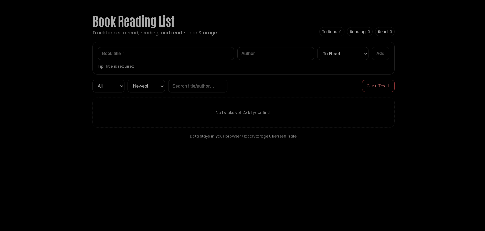

# Book Reading List (React + styled-components)



**Live Demo:** https://a2rp.github.io/book-reading-list/

A lightweight, frontend-only app to track books you **want to read**, are **reading**, and have **read**. Dark-theme friendly (no background overrides) and fully **LocalStorage** powered.

## Features

-   Add books with **title**, author, status (To Read / Reading / Read)
-   **Quick status actions** (📖 Reading / ✅ Read)
-   Edit details: **pages, progress, dates, notes**
-   **Search** by title/author, **filter** by status, **sort** (Newest, Title, Author, Status)
-   **Clear all "Read"** books (confirm modal)
-   Custom **confirm/success modals**
-   Data persists in **LocalStorage** (refresh-safe)

## Local Install

```bash
# 1) Clone the repo
git clone https://github.com/a2rp/book-reading-list.git
cd book-reading-list

# 2) Install dependencies
npm i

# 3) Run dev server
npm run dev
```
