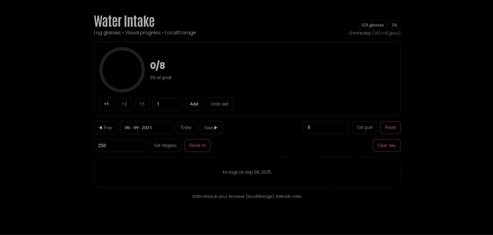

# Book Reading List

A focused React and Vite reading tracker for books you want to read, are reading, or have finished. Data stays in the browser with LocalStorage.



## Features

- Add books with title, author, and reading status
- Search, filter, and sort your list
- Track pages, progress, notes, and dates
- Quick status actions and edit flow
- Confirmation dialogs for destructive actions
- Responsive dark interface with local persistence

## Run locally

```bash
npm install
npm run dev
```

Build with `npm run build` and deploy to GitHub Pages with `npm run deploy`.

## Links

- Live: https://a2rp.github.io/book-reading-list/
- Repository: https://github.com/a2rp/book-reading-list
- Portfolio: https://www.ashishranjan.net/
- GitHub: https://github.com/a2rp
- CodePen: https://codepen.io/ash1198
- LinkedIn: https://www.linkedin.com/in/aashishranjan
- Facebook: https://www.facebook.com/theash.ashish/
- YouTube: https://www.youtube.com/@ashishranjan-ashz?sub_confirmation=1
- Email: mailto:ash.ranjan09@gmail.com

## Support

- Support: https://a2rp-donation-page.netlify.app/
- Buy Me a Coffee: https://buymeacoffee.com/a2rp
- Patreon: https://www.patreon.com/a2rp
